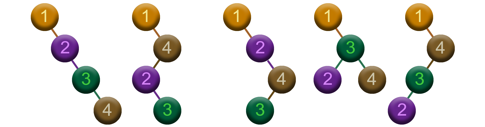
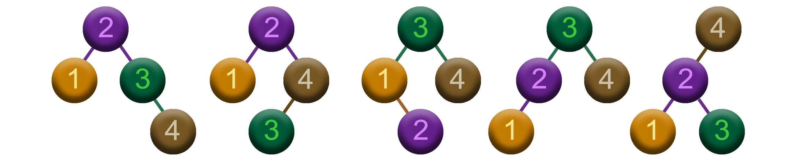

$\huge{\color{Cadetblue}\text{Optimal Binary}}$  
$\huge{\color{Cadetblue}\text{Search Trees (OBST)}}$

 

$\Large{\color{rosybrown}\text{Problem}}$

Given a sorted sequence of $n$ distinct keys $K = \langle k_0, k_1, \ldots, k_{n-1} \rangle$ in increasing order, and a sequence of $n$ search probabilities $P = \langle p_0, p_1, \ldots, p_{n-1} \rangle$ that sum to 1, the task is to build an optimal binary search tree (OBST) for $K$. The probability $p_i$ represents the probability that a search will be for key $k_i$, and an OBST is a binary search tree for which the average search time is minimized, that is, the expected search cost is minimized.

Now, the expected search cost of a binary search tree is the sum of the costs of each key, where the cost of a key $k_i$ is the depth of $k_i$ in the tree plus 1, weighted by the probability of searching for $k_i$. As is customary, the depth of a key in a binary search tree is given by the length of the unique simple path from the root to the node containing the key. This means that the depth of the root is 0, and the depth of any other node is 1 plus the depth of its parent.  

Thus, the ${\color{peru}\text{expected search cost}}$ for a BST $T$ is given by the following formula:

$$\color{darkslateblue}\boxed{\color{peru}\space
e(T) = \sum_{i=0}^{n-1} p_i \cdot (d_i + 1)\space}$$

where $d_i$ is the depth of the key $k_i$ in the BST.

 

$\Large{\color{rosybrown}\text{Example}}$

Consider the example where we have some natural numbers as keys, and their corresponding search probabilities. The keys are $K = \langle 1, 2, 3, 4 \rangle$, and the search probabilities are $P = \langle 0.3, 0.1, 0.2, 0.4 \rangle$. The task is to build an OBST for the keys in $K$. 

The number of possible binary search trees for $n$ keys is $C_n$, where $C_n$ is the $n^{th}$ ${\color{mediumorchid}\text{Catalan number}}$. It can be computed using the following formula:

$${\color{mediumorchid}C_n = \frac{1}{n+1} \binom{2n}{n}}$$

So, for $n = 3$, we have $C_3 = 5$ possible binary search trees. In our example, we have $n = 4$ keys, so we have $C_4 = 14$ possible binary search trees, as shown in the figures below.

 

 

Each of these $14$ trees provides a different way of organizing the keys, while maintaining the BST property, and each comes with its own expected search cost. From left to right, and top to bottom, the expected search costs, using the formula above, are: $2.7$, $2.2$, $2.5$, $2.2$, $2.1$, $2.3$, $2.1$, $1.9$, $2.1$, $2.1$, $2.1$, $2.0$, $2.1$, and $2.3$. So, out of the $14$ possible binary search trees, the ${\color{peru}\text{optimal}}$ binary search tree is the one with the minimum expected search cost, which is $1.9$.

 

$\Large{\color{darkseagreen}\text{The key idea}}$

The question then is how to build an OBST from a sorted sequence of keys and their corresponding search probabilities in an efficient manner. At first glance, it seems that we could build such a tree by using a [greedy strategy](https://github.com/pl3onasm/CLRS/tree/main/algorithms/greedy), where we always choose the key with the maximum search probability as the root of the (sub)tree, and then recursively build the left and right subtrees.

While this strategy may work in some cases, it does not guarantee that the resulting tree will be optimal. This is also illustrated by the example above: the BST generated by the greedy strategy, shown on the left in the figure below, has an expected search cost of $2.0$, which is not the optimal expected search cost of the OBST shown on the right, which is $1.9$.

 

   

Thus, we need to resort to a more systematic approach to building an OBST. The idea here is to build the OBST by considering all possible subtrees of the keys, and then choosing the one that minimizes the expected search cost. In other words, we think of the subproblems in terms of ${\color{peru}\text{substrings}}$ of the key sequence, and build the solution for the subproblem by considering each key in the substring as the root of the subtree. By doing so, we can then build the OBST recursively, starting with the smallest substring and building up to the full sequence of keys.

At each step, we consider the keys $k_i, k_{i+1}, \ldots, k_j$ and build the subtree rooted at $k_r$, where $i \leq r \leq j$. The expected search cost of the subtree rooted at $k_r$ is then the sum of the expected search costs of the left and right subtrees, plus the cost of searching for $k_r$. Eventually, we choose the root $k_r$ that minimizes the expected search cost of the subtree.  

Thus, the expected search cost of the subtree rooted at $k_r$ can be computed recursively, as follows:

$$\color{darkslateblue}\boxed{\color{rosybrown}\space
e(i, j) = \begin{cases}
0 & \scriptsize \text{if } j = i - 1 \\
\text{min} \lbrace e(i, r-1) + e(r+1, j) & \\
\qquad + \space w(i, j) \space : \space i \leq r \leq j \rbrace & \scriptsize \text{if } i \leq j
\end{cases}\space}$$

 

where $e(i, j)$ is the expected search cost of the subtree rooted at $k_r$, and $w(i, j)$ is the sum of the probabilities of the keys from $k_i$ to $k_j$. The base case occurs when $j = i - 1$, in which case the subtree is empty and the expected search cost is 0. The recursive case happens when $i \leq j$, in which case we consider all possible roots $k_r$ in the range $i \leq r \leq j$, and choose the one that minimizes the expected search cost of the subtree. The expected search cost of the orignal problem is then given by $e(0, n-1)$, where $n$ is the number of keys in the input sequence.

Note the strong similarity with the [matrix-chain multiplication algorithm](https://github.com/pl3onasm/CLRS/tree/main/algorithms/dynamic-programming/matrix-chain-mult), where we consider all possible ways of multiplying matrices in a similar way, and aim to minimize the cost of the product by choosing the optimal split point. In the case of OBSTs, we want to minimize the expected search cost of the tree by choosing the optimal root of the (sub)tree. The similarity of the two algorithms is also reflected in their recurrence relations, which are almost identical.  

 

$\Large{\color{darkseagreen}\text{Brute force}}$

The brute force approach simply impements the recursive formula as is, without any optimization. This results in an exponential time complexity, which is clearly not practical for large values of $n$. The brute force approach is solely presented here for illustrative purposes, in order to show the recursive nature of the problem and how the dynamic programming solution improves upon it.

Implementation: [OBST - Brute Force](https://github.com/pl3onasm/CLRS/tree/main/algorithms/dynamic-programming/opt-bsts/obst-1.c)

 

$\Large{\color{darkseagreen}\text{Top-down}}$

The top-down approach optimizes the brute force solution by storing the results of the subproblems in a table, so that they need not be recomputed. This is done by using a 2D array $dp$, where $dp[i][j]$ stores the expected search cost of the optimal BST for the keys $k_i, k_{i+1}, \ldots, k_j$. By ${\color{peru}\text{memoizing}}$ the results of the subproblems in this way, each subproblem is solved only once, and the results are reused when needed. This results in a time complexity of $\mathcal{O}(n^3)$, which is much more efficient than the brute force approach.

Implementation: [OBST - Top-down](https://github.com/pl3onasm/CLRS/tree/main/algorithms/dynamic-programming/opt-bsts/obst-2.c)

 

$\Large{\color{darkseagreen}\text{Bottom-up}}$

The bottom-up approach is an iterative version of the top-down approach, where the subproblems are solved in a bottom-up manner, starting with the smallest subproblems and building up to the full sequence of keys. This is done by filling the table $dp$ in a bottom-up fashion, starting with the base cases and then computing the results of the subproblems in increasing order of size. The time complexity of the bottom-up approach is also in $\mathcal{O}(n^3)$.

Implementation: [OBST - Bottom-up](https://github.com/pl3onasm/CLRS/tree/main/algorithms/dynamic-programming/opt-bsts/obst-2.c)

${\color{peru}\text{Reconstruction}}$ of an optimal BST is also possible. This is done by storing the roots of the optimal subtrees in a separate table $r$, which is used to reconstruct the optimal BST. We start at the root of the optimal BST, which is stored in $r[0][n-1]$, and build the left and right subtrees recursively, using the roots stored in $r$ until we reach the leaves of the tree. The reconstruction of the optimal BST is done in $\mathcal{O}(n)$ time.

Implementation: [OBST - Reconstruction](https://github.com/pl3onasm/CLRS/tree/main/algorithms/dynamic-programming/opt-bsts/obst-4.c)

The reconstructed tree is presented in a very compact form, where the keys are printed in an inorder traversal of the tree, and the depth of each key is also printed. The depth of the root is 0, and the depth of any other key is 1 plus the depth of its parent. In order to help you interpret and visualize the reconstructed tree from the output, a visual representation of the tree has been provided for a few test cases: [test case 2](https://github.com/pl3onasm/CLRS/tree/main/algorithms/dynamic-programming/opt-bsts/images/obsts-test2.png), [test case 3](https://github.com/pl3onasm/CLRS/tree/main/algorithms/dynamic-programming/opt-bsts/images/obsts-test3.png), [test case 5](https://github.com/pl3onasm/CLRS/tree/main/algorithms/dynamic-programming/opt-bsts/images/obsts-test5.png). Test case 1 is the same as the example presented above.

 

$\Large{\color{darkseagreen}\text{Knuth's optimization}}$
$\Large{\color{darkseagreen}\text{(Ex 15/14.5-4)}}$

The DP approach can be optimized by using Knuth's optimization, which reduces the time complexity to $\Theta(n^2)$. The idea is to exploit the fact that the subproblems are computed in a specific order, and that the optimal root of the subtree lies in a certain range. The range of the optimal root is given by the following formula:

$$\color{darkslateblue}\boxed{\color{rosybrown}\space
r(i,j - 1) \leq r(i,j) \leq r(i + 1,j)\space}$$

where $r(i,j)$ is the optimal root of the subtree rooted at $k_r$. So, instead of considering all possible roots $k_r$ in the range $i \leq r \leq j$, we only consider the roots in the range $r(i,j - 1) \leq r \leq r(i + 1,j)$. Exploiting this property, the time complexity of the DP solution can be reduced to $\Theta(n^2)$. For this to work, we do need to precompute the sums of the probabilities of the keys over all ranges, which can be done in $\Theta(n^2)$ time.

Implementation: [OBST - optimized](https://github.com/pl3onasm/CLRS/tree/main/algorithms/dynamic-programming/opt-bsts/obst-5.c)

 

$\Large{\color{darkseagreen}\text{Note}}$

The book CLRS presents the algorithm in a slightly different way, by not only considering the probabilities of successful searches, but also the probabilities of failed searches, which are represented by dummy keys. The idea is to build a complete binary search tree, where each key $k_i$ is the root of a subtree, and the dummy keys are the leaves of the tree, with the probabilities of the dummy keys being those search probabilities that are associated with the keys that are not in the sequence.  
Obviously, this is only practical if the ordered key sequence is incomplete, and we need to add dummy keys to make it complete. If the key sequence is already complete, then there is no need to add dummy keys. For the sake of simplicity, the dummy keys have been left out of the discussion and the implementation.  
