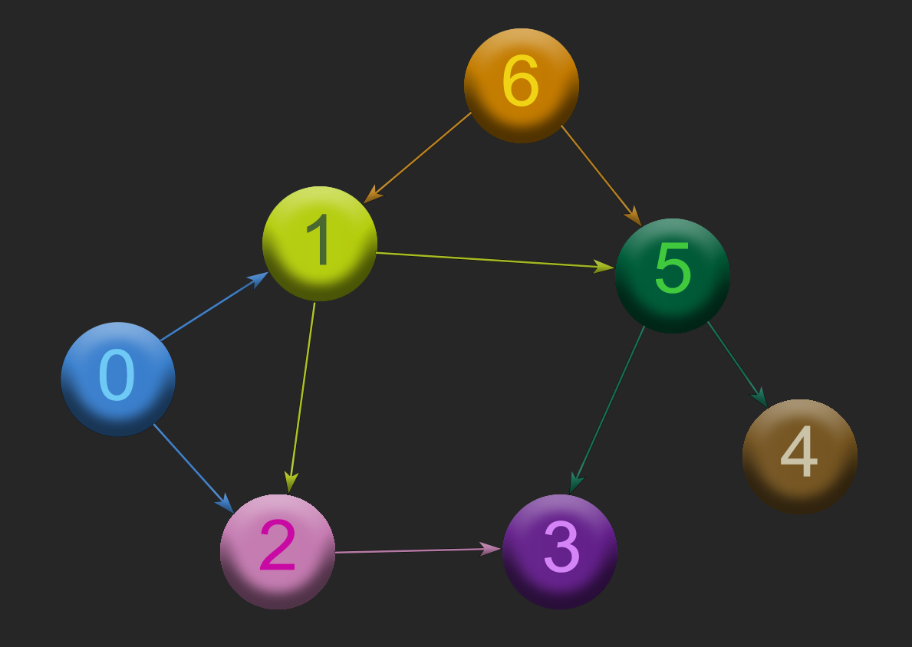
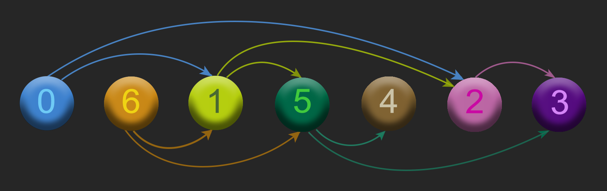

# Topological sort of a graph (TPS)

## Problem

Given a directed acyclic graph (DAG), find a topological sort of its vertices. A topological sort of a directed graph is a linear ordering of its vertices such that for every directed edge $(u,v)$ from vertex $u$ to vertex $v$, $u$ comes before $v$ in the ordering. We can think of a topological sort as a sort of flattened DAG, where the edges are removed and the vertices are ordered in such a way that the dependencies between the vertices are preserved. Note that a topological sort is not necessarily unique.

## Solution

A topological sort can be achieved by using a depth-first search (DFS) of the graph. By running a DFS on the graph, each vertex is given a finishing time. The vertices are then sorted in decreasing order of their finishing times: this can be done by using a linked list and prepending each vertex to the list as it is finished. The resulting list is then the topological sort of the graph.

Implementation: [TPS](https://github.com/pl3onasm/Algorithms/tree/main/algorithms/graphs/top-sort/tps.c)

## Complexity

The time complexity of the algorithm is $O(V+E)$, where $V$ is the number of vertices and $E$ is the number of edges in the graph. The space complexity is $O(V)$, since we need to store the topological sort of the graph.

## Example

We have the following DAG representing a dependency graph of tasks to be performed, where an arrow from task $u$ to task $v$ means that task $u$ must be completed before task $v$:

  

The topological sort of the above graph is a linear ordering of its vertices such that for every directed edge $(u,v)$ from vertex $u$ to vertex $v$, $u$ comes before $v$ in the ordering. A topological sort of the above graph is the permutation $0,6,1,5,4,2,3$:

Note that this topological sort is not unique. For example, the permutation $6,0,1,5,2,4,3$ is another valid topological sort of the graph.
