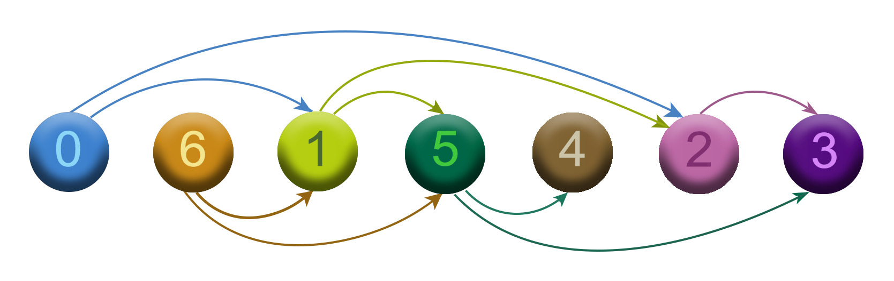

$\huge{\color{Cadetblue}\text{Topological sort}}$  

 

$\Large{\color{rosybrown}\text{Problem}}$

Given a ${\color{peru}\text{directed acyclic graph (DAG)}}$, find a topological sort of its vertices. A topological sort of a directed graph $G$ is a linear ordering of its vertices such that for every directed edge $(u,v)$ from vertex $u$ to vertex $v$, $u$ comes before $v$ in the ordering. We can think of the sort as a permutation of the vertices of the graph such that each vertex appears before all of its descendants. Another way is to visualize it as a flattened graph, where the edges are removed and the vertices are ordered in such a way that the dependencies (predecessor relationships) between the vertices are preserved. Note that a topological sort is not necessarily unique.

 

$\Large{\color{darkseagreen}\text{Solution}}$

A topological sort can be achieved by running a [DFS](https://github.com/pl3onasm/CLRS-in-C/tree/main/algorithms/graphs/dfs) on the graph. While the graph is traversed, we prepend each node to a linked list when it is assigned a finish time (colored black). The resulting list is then the topological sort of the graph. The time complexity of the algorithm is $\mathcal{O}(V+E)$, since we need to run a DFS on the graph and list insertion takes $\mathcal{O}(1)$ time.  

The program omits the color attribute of the nodes, since it is not needed to find a topological sort. Note that the program outputs a possible topological sort of the graph which is not necessarily unique.  
Implementation: [TPS](https://github.com/pl3onasm/Algorithms/tree/main/algorithms/graphs/top-sort/tps.c)

 

$\Large{\color{darkseagreen}\text{Example}}$

We have the following DAG representing a dependency graph of tasks to be performed, where an arrow from task $u$ to task $v$ means that task $u$ must be completed before task $v$:

   

The topological sort of the above graph is a linear ordering of its vertices such that for every directed edge $(u,v)$ from vertex $u$ to vertex $v$, $u$ comes before $v$ in the ordering. A topological sort of the above graph is the permutation $0,6,1,5,4,2,3$:

 

Note that this topological sort is ${\color{peru}\text{not unique}}$. For example, the permutation $6,0,1,5,2,4,3$ is another valid topological sort of the same graph.

 

$\Large{\color{darkseagreen}\text{Video}}$

