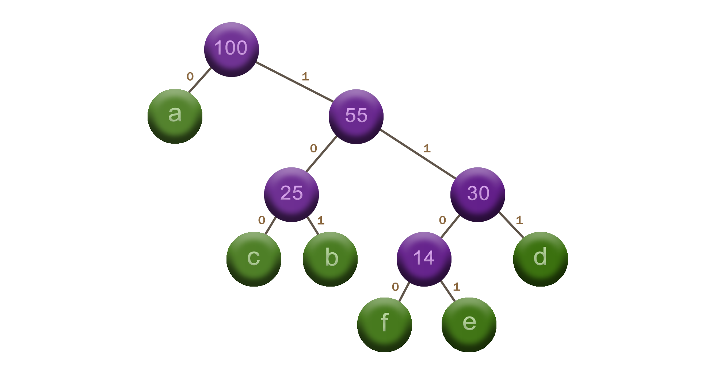

$\huge{\color{Cadetblue}\text{Huffman codes}}$  

<br />

${\Large\color{rosybrown}\text{Problem}}$

Given is a text made up of characters taken from a subset $\sigma$ of size $n$ of a certain alphabet $\Sigma$. This text needs to be encoded into binary code by means of a mapping from the characters in $\sigma$ to binary strings, known as codewords. These codewords are said to be ${\color{peru}\text{prefix-free}}$ if no codeword is a prefix of another codeword, and their length is defined as the number of bits in their corresponding bit string representation. Our task then is to find the optimal prefix-free binary code that minimizes the total length of the encoded text, which is computed as the sum of the lengths of the codewords of all characters in the text.

<br />

${\Large\color{darkseagreen}\text{Huffman's algorithm}}$

The key idea here is that the most frequent characters in the text should be encoded with the shortest codewords in order to minimize the total length of the encoded text. This is why the algorithm works with variable-length codewords, as opposed to fixed-length codewords.  

The algorithm constructs an optimal prefix-free binary code by building a full binary tree, known as the ${\color{peru}\text{Huffman tree}}$, from the bottom up. It starts by creating a leaf node for each distinct character in the text (i.e. for each element in $\sigma$), with the frequency of each character as the key of the node. These nodes are then inserted in a min-priority queue, ordered by character frequency. The algorithm then proceeds to extract the two nodes with the lowest frequency from this queue, creating a new node with the two extracted nodes as its children, and then inserts this new node back into the queue with a key equal to the sum of the frequencies of its children. This process is repeated until only one node remains in the queue, which is the root of the Huffman tree.

From this tree, we can then determine the codeword for each character by traversing the tree from the root to the leaf node containing the character and recording the direction of each edge traversed: a $0$ for a left child and a $1$ for a right child. The resulting codeword for the character is then the sequence of zeros and ones encountered on the path from the root to the leaf node.

At each step the algorithm makes the ${\color{peru}\text{greedy choice}}$ of grabbing the two nodes with the lowest frequency, which is optimal because it ensures that the most frequent characters end up having the shortest paths from the root to their leaf nodes, and the least frequent characters end up having the longest ones, resulting in a minimal total length of the encoded text. The choice is also safe, as the algorithm constructs a full binary tree with the characters as its leaves, so that by the end of the process, we are guaranteed to have an optimal prefix-free binary code.

The running time of the algorithm is $\mathcal{O}(n\log{n})$, where $n = \mid \sigma \mid$, the number of distinct characters in the text. This is because the algorithm performs $n-1$ iterations, in order to generate a binary tree with $n-1$ internal nodes. Each of these iterations takes $\mathcal{O}(\log{n})$ time as it involves two extract-min operations and one insert operation, all of which take $\mathcal{O}(\log{n})$ time for a min-priority queue of size $n$ implemented as a binary min-heap.

The implementation outputs the codewords and frequencies for each character in the text, as well as a representation of the constructed Huffman tree. The tree is displayed in a compact form by printing the nodes in an inorder traversal, along with the edges and their directions ($0$ for left and $1$ for right) leading to them. For instance, test case 2 corresponds to the example given in the book, and produces the below output.

<br />

```
CODEWORD TABLE

char      freq       code
   a        45       0
   c        12       100
   b        13       101
   f         5       1100
   e         9       1101
   d        16       111


HUFFMAN TREE

-0 [45] 'a'
root [100]
-1-0-0 [12] 'c'
-1-0 [25]
-1-0-1 [13] 'b'
-1 [55]
-1-1-0-0 [5] 'f'
-1-1-0 [14]
-1-1-0-1 [9] 'e'
-1-1 [30]
-1-1-1 [16] 'd'

```

<br />

A visual interpretation of this output is shown in the figure below.

<p align="center" width="85%">

</p>

In order to further help interpret and visualize the output, visual representations have been included for a few more test cases: [test case 5](https://github.com/pl3onasm/CLRS/blob/main/algorithms/greedy/huffman/images/hfc-test5.png), [test case 6](https://github.com/pl3onasm/CLRS/blob/main/algorithms/greedy/huffman/images/hfc-test6.png).

Implementation: [Huffman](https://github.com/pl3onasm/AADS/tree/main/algorithms/greedy/huffman/huffman.c)
