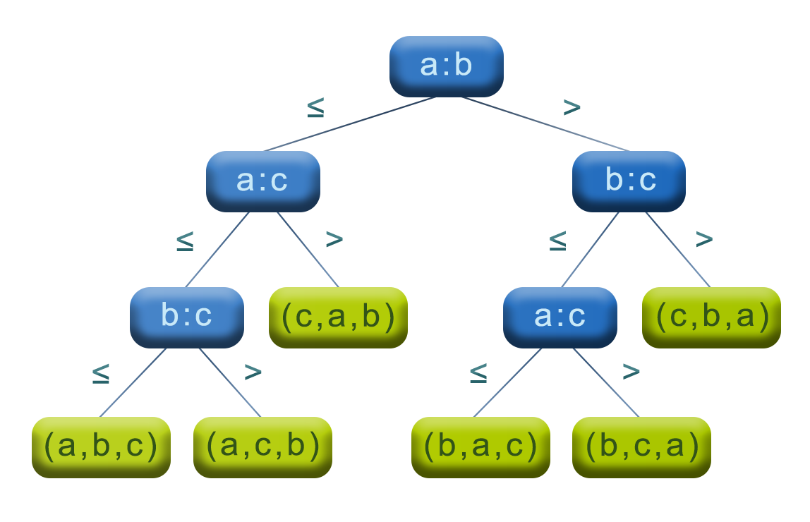

$\huge{\color{Cadetblue}\text{Sorting Algorithms}}$

 

$\Large{\color{Rosybrown}\text{Overview}}$

| ${\color{peru}\text{Complexity}}$ | ${\color{peru}\text{CLRS}}$ | ${\color{peru}\text{Topic}}$ |
|:---|:---:|:---|
| ${\color{darkcyan}\Theta(n + k)}$ | 8.2 | [Counting sort](https://github.com/pl3onasm/Algorithms-and-data-structures/tree/main/algorithms/sorting/counting-sort)|
| ${\color{darkcyan}\Theta(d(n + k))}$ | 8.3 | [Radix sort](https://github.com/pl3onasm/Algorithms-and-data-structures/tree/main/algorithms/sorting/radix-sort)|
|  ${\color{darkcyan} \approx \Theta(n)}$ [^1] | 8.4 |  [Bucket sort](https://github.com/pl3onasm/Algorithms-and-data-structures/tree/main/algorithms/sorting/bucket-sort)|
| ${\color{darkcyan}\Theta(n\log n)}$ | 2.3 |  [Merge sort](https://github.com/pl3onasm/Algorithms-and-data-structures/tree/main/algorithms/sorting/merge-sort)|
| ${\color{darkcyan}\Theta(n\log n)}$ | – |  [WHAM sort](https://github.com/pl3onasm/Algorithms-and-data-structures/tree/main/algorithms/sorting/merge-sort#wham-sort)|
| ${\color{darkcyan}\mathcal{O}(n\log n)}$ | 6.4 |   [Heapsort](https://github.com/pl3onasm/Algorithms-and-data-structures/tree/main/algorithms/sorting/heap-sort)|
| ${\color{darkcyan}\approx \mathcal{O}(n\log n)}$ | 7.1-3 |  [Quicksort](https://github.com/pl3onasm/Algorithms-and-data-structures/tree/main/algorithms/sorting/quick-sort)|
| ${\color{darkcyan}\mathcal{O}(n^2)}$ | 2.1-2 |  [Insertion sort](https://github.com/pl3onasm/Algorithms-and-data-structures/tree/main/algorithms/sorting/insertion-sort)|
| ${\color{darkcyan}\mathcal{O}(n^2)}$ | Ex 2.2-2 |  [Selection sort](https://github.com/pl3onasm/Algorithms-and-data-structures/tree/main/algorithms/sorting/selection-sort)|
| ${\color{darkcyan}\mathcal{O}(n^2)}$ | Prob 2-2 | [Bubble sort](https://github.com/pl3onasm/Algorithms-and-data-structures/tree/main/algorithms/sorting/bubble-sort)|

[^1]: The ≈ symbol means that this is the expected complexity: the complexity is not guaranteed, but it is the average case complexity. The worst case complexity is higher.

 

$\Large{\color{Rosybrown}\text{Sorting Problem}}$

The task of sorting is to rearrange a given sequence of elements into a particular order given by a comparison function, denoted by $\leq$, which is defined on the elements of the sequence and is assumed to be total, antisymmetric and transitive. In other words, given a sequence $A = \langle a_1, a_2, \dots, a_n \rangle$, the sorted output should be the permutation $A' = \langle a'_1, a'_2, \dots, a'_n \rangle$ satisfying the condition $a'_1 \leq a'_2 \leq \dots \leq a'_n$.

 

$\Large{\color{darkseagreen}\text{Comparison Sorts}}$

Most sorting algorithms are comparison sorts: they determine the new order of a sequence by comparing the input elements with one another. Suppose that the input consists of $3$ elements $a, b, c$. Then there are $3! = 6$ possible orderings of these elements. A comparison sort algorithm examines the ordering of each pair of these elements and makes decisions based on the made comparisons.

This is illustrated in the below decision tree. Each internal node (in blue) is labeled with a comparison of two input elements. The left child of the node is taken if the comparison is true, and the right child is taken otherwise. Any simple path from the root of the tree to a leaf (in green) represents an execution of the comparison sort algorithm on the input $a, b, c$, and shows the comparisons performed by the algorithm to get the output sequence shown in the leaf, which is in fact a permutation of the input sequence. The decision tree thus represents all possible executions of the comparison sort algorithm.

   

The number of comparisons performed by a comparison sort algorithm for a given input corresponds to the path length from the root to the leaf in the decision tree. Thus, the longest path from the root to a leaf corresponds to the worst-case number of comparisons for a given input of size $n$. In other words, the height of the decision tree represents the worst-case running time of a comparison sort algorithm.

Let $l$ be the number of leaves in the decision tree. Since a decision tree is a full binary tree (each decision node has exactly two children), it has at most $2^h$ leaves, where $h$ is the height of the tree, so that $l \leq 2^h$. Each permutation of the input elements appears as a label on one or more leaves of the decision tree[^2], so that $l \geq n!$. Thus, $n! \leq l \leq 2^h$, which implies $h \geq \log(n!)$. Rewriting the latter term as a sum, we get, for $n > 2$:

$$
\begin{align*}
{\color{olive}\log(n!)} &=  \sum_{i=1}^n \log(i)\\
&= \sum_{i=1}^{\lfloor n/2 \rfloor} \log(i) + \sum_{i= \lfloor n/2 \rfloor +1}^n \log(i)\\
& {\color{olive} \boldsymbol{>}} \sum_{i=1}^{\lfloor n/2 \rfloor} 1 + \sum_{i=\lfloor n/2 \rfloor +1}^n \log(n/2)\\
& = \lfloor n/2 \rfloor + \lfloor n/2 \rfloor \log(n/2)\\
&= \lfloor n/2 \rfloor + \lfloor n/2 \rfloor \log(n) - \lfloor n/2 \rfloor \log(2)\\
&= \lfloor n/2 \rfloor \log(n) + \lfloor n/2 \rfloor - \lfloor n/2 \rfloor\\
&= \lfloor n/2 \rfloor \log(n)\\
&= {\color{olive}\Theta(n\log n)}
\end{align*}
$$

As a result, $h = \Omega(\log(n!)) = \Omega(n\log n)$. Since the height of the decision tree is the worst-case running time of a comparison sort algorithm, we conclude that any comparison sort algorithm requires $\Omega(n\log n)$ comparisons in the worst case.

 

$\Large{\color{darkseagreen}\text{Linear-time Sorts}}$

The only way to escape the $\Omega(n\log n)$ lower bound for comparison sorts is to exploit special properties of the input elements, such as the range of possible values. This is exactly what linear-time sorts do. The most well-known non-comparison sorts are counting sort, radix sort and bucket sort. For example, counting sort assumes that the input elements are integers in the range $0$ to $k$, for some integer $k = \mathcal{O}(n)$. Radix sort assumes that the input elements are integers represented in a fixed number of digits in some base $b$. And bucket sort assumes that the input elements are uniformly distributed in the interval $[0, 1)$.

[^2]: If all elements are distinct, each permutation appears on exactly one leaf: l = n!.
If some elements are equal, some permutations appear on more than one leaf: l > n!.
